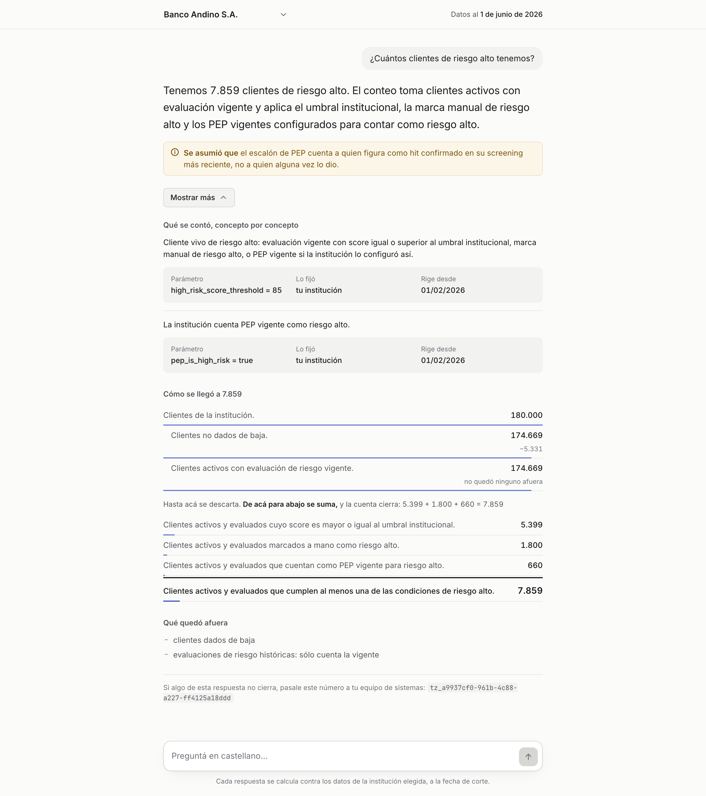

# Compliance conversacional

Un oficial de cumplimiento —que no es técnico y no lee SQL— pregunta en castellano
sobre los datos de **su** institución, y recibe un número que puede defender.

La respuesta es **una sola oración** con la cifra adentro. Detrás de *Mostrar más* está
lo que la sostiene, en el orden en que se audita: qué se contó concepto por concepto,
con el parámetro que se aplicó, quién lo fijó y desde cuándo rige; cómo se llegó al
número, escalón por escalón y con la proporción de cada uno; qué quedó afuera; y las
filas reales.

Cuando la respuesta no es un número sino varios —altas por mes, alertas por estado— se
**dibuja**, arriba y junto a la oración, con su tabla desplegada debajo. Sólo ahí: una
respuesta de un solo número no lleva gráfico ni lo ofrece, y un desglose por moneda
tampoco, porque compartir un eje de valores sería sumar visualmente lo que los números no
suman.

Cuando la pregunta admite más de una lectura y la diferencia importa, **repregunta** con
opciones en vez de elegir. Cuando elige, **lo declara arriba del número** y no plegado.
Cuando la data no alcanza, **lo dice**: nunca disfraza un faltante de cero.

Todo se interpreta contra una fecha de corte fija —**1 de junio de 2026**—, que está
siempre a la vista: "este año" es enero-2026 a esa fecha, y nunca lo que diga el reloj.

## La pantalla



## Cómo levantarlo

Hace falta Docker (con **≥ 4 GB** de RAM asignados), Python 3.13, Node 24 y una key de
OpenAI. El dump de la base **no está en el repo**: el link de descarga va aparte.

```bash
# 1. La base, y el dump adentro (~5-10 min)
mkdir -p dump && cp /donde/lo/hayas/bajado/compliance.dump dump/
docker compose up -d db
docker compose run --rm restore

# 2. Las dependencias
python3 -m venv .venv && .venv/bin/pip install -r requirements.txt
cd web && npm install && cd ..

# 3. El entorno
cp .env.example .env
```

En `.env` hay tres variables **sin default**, y el proceso no arranca si falta alguna:
`AGENT_RO_PASSWORD` (la elegís vos; el bootstrap se la aplica al rol de sólo lectura),
`OPENAI_API_KEY` y `OPENAI_MODEL`. El resto ya viene con los valores del
`docker-compose.yml`, que está versionado.

```bash
# 4. El rol read-only, el aislamiento por institución y los grants
.venv/bin/python scripts/restaurar.py --solo-bootstrap

# 5. Que la base restaurada sea la que se espera
.venv/bin/python scripts/smoke_check.py
```

El paso 4 **no es opcional y hay que repetirlo después de cada restore**: `pg_restore
--clean` se lleva puestos los GRANT y las políticas de RLS.

Y a correr, en dos terminales:

```bash
.venv/bin/uvicorn api.main:app --reload --port 8000   # la API
cd web && npm run dev                                  # la pantalla, en :5173
```

La API expone `GET /health`, `GET /instituciones`, `POST /ask` y
`GET /auditoria/{traza_id}`. Esa última es para IT: el SQL, el plan y los tiempos no
están en la pantalla, se leen contra el `traza_id` que la respuesta muestra abajo.

### El set de evaluación

```bash
.venv/bin/python evals/run.py --corridas 1 --workers 4
```

Cuesta plata: 33 preguntas contra el modelo configurado son ~US$3,6 por corrida. Escribe
un reporte en `evals/reports/`, y los de las corridas que ya se hicieron están
versionados ahí.

## Cómo desplegarlo

El frontend va a **Vercel** y el backend a **Railway**. Los archivos de configuración ya
están en el repo: `railway.json` y `.python-version` en la raíz, `web/vercel.json`.

**El backend, en Railway.** Apuntá el servicio a la raíz del repo; `railway.json` ya
declara el arranque (`uvicorn api.main:app --host 0.0.0.0 --port $PORT`) y el healthcheck
contra `/health`. Va con **una sola réplica** a propósito: las trazas de
`/auditoria/{traza_id}` viven en memoria del proceso, y con dos réplicas la mitad de los
pedidos daría 404.

**La base.** Agregá el plugin de Postgres —que inyecta `DATABASE_URL`, que es lo que el
backend prefiere— y restaurá el dump contra su URL pública, desde tu máquina:

```bash
DATABASE_URL='postgresql://...' AGENT_RO_PASSWORD='...' \
  .venv/bin/python scripts/restaurar.py dump/compliance.dump
```

El script hace el `pg_restore` y aplica el bootstrap, en ese orden. Pide confirmación
antes de tocar un host que no sea local, porque `--clean` vacía la base antes de escribir.

**El frontend, en Vercel.** *Root Directory* = `web`. El resto lo dice `web/vercel.json`.

| Variable | Dónde | Nota |
|---|---|---|
| `DATABASE_URL` | Railway | La inyecta el plugin de Postgres |
| `AGENT_RO_USER` · `AGENT_RO_PASSWORD` | Railway | El mismo password con el que corriste el bootstrap |
| `OPENAI_API_KEY` · `OPENAI_MODEL` | Railway | Sin default: el proceso no levanta si faltan |
| `VITE_API_URL` | Vercel | La URL pública del backend |
| `VITE_FECHA_DE_CORTE` | Vercel | Opcional; default `2026-06-01` |

Dos cosas que el deploy no resuelve. El dump son 1.6 GB, así que el paso de la base es
manual y tarda. Y los parámetros de servidor del `docker-compose.yml` —`shared_buffers`,
`work_mem`— no viajan a Railway: el `statement_timeout` de 15 s sí, porque se lo pone
`ALTER ROLE` al rol del agente, pero el techo de costo del gate se midió con la memoria
del compose y allá los planes pueden costar distinto.

## Lo que acompaña

| Archivo | Qué hay adentro |
|---|---|
| `CONTEXT.md` | El glosario del dominio: qué significa cada palabra en la pantalla y en el código |
| `DECISIONS.md` | Las decisiones, con lo que se descartó y por qué |
| `DATA_DICTIONARY.md` | Los datos, tal como vienen |
| `NOTES/` | El log del proceso, hito por hito |
| `evals/reports/` | Las corridas del eval, con sus números y sus fallas |
| `web/DESIGN.md` | El sistema visual de la pantalla, tal como quedó construido |
