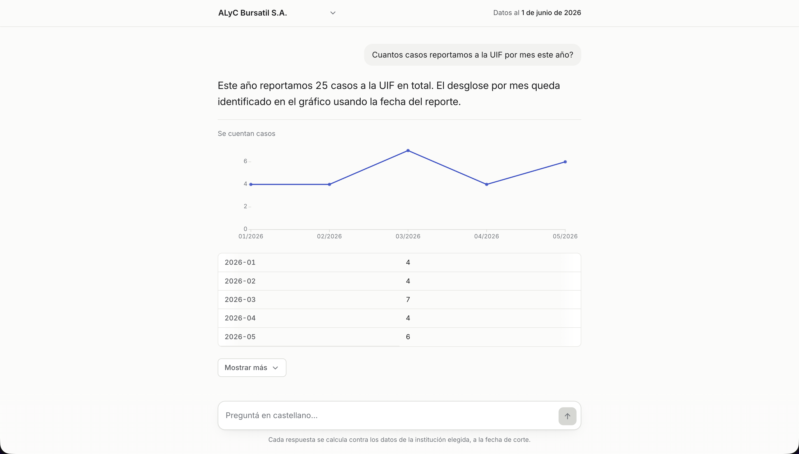

# Compliance conversacional

Compliance conversacional es un asistente para que un oficial de cumplimiento —que no
es técnico y no lee SQL— pregunte sobre los datos de **su** institución, y
reciba un número que puede defender.

Es una chatbot web que permite que un oficial de compliance que no lee SQL pudiera confiar en un número y auditarlo, y mostrar la consulta no alcanza para eso. Lo que funciona es apoyarse en dos cosas que un oficial de compliance sí sabe hacer: entender cómo se llegó al número, viendo la derivación en cascada escalón por escalón, y verificarlo contra lo que ya conoce, mirando las filas reales. 

La respuesta es **una sola oración** con la cifra adentro. Detrás de *Mostrar más* está
lo que la sostiene, en el orden en que se audita: qué se contó concepto por concepto,
con el parámetro que se aplicó, quién lo fijó y desde cuándo rige; cómo se llegó al
número, escalón por escalón y con la proporción de cada uno; qué quedó afuera; y las
filas reales.

Cuando la respuesta no es un número sino varios —altas por mes, alertas por estado— se
**dibuja**, arriba y junto a la oración, con su tabla desplegada debajo. Sólo ahí: una
respuesta de un solo número no lleva gráfico ni lo ofrece, y un desglose por moneda
tampoco, porque compartir un eje de valores sería sumar visualmente lo que los números no
suman.

Cuando la pregunta admite más de una lectura y la diferencia importa, **repregunta** con
opciones en vez de elegir. Cuando elige, **lo declara arriba del número** y no plegado.
Cuando la data no alcanza, **lo dice**: nunca disfraza un faltante de cero.

## En producción

Hay una versión funcionando en [primo.martinbejarano.com](https://primo.martinbejarano.com).

## La pantalla




El gráfico es una feature extra, se dibuja sólo cuando la respuesta es una serie (altas por mes, alertas por estado, etc). Una tendencia se lee más rápido en una forma que en una lista de números, y la tabla sigue ahí para que ese vistazo se pueda verificar fila por fila. La regla completa está en D-19, `DECISIONS.md`.

## Cómo levantarlo

Hace falta Docker (con **≥ 4 GB** de RAM asignados), Python 3.13, Node 24 y una key de
OpenAI. El dump de la base **no está en el repo**: el link de descarga va aparte.

```bash
# La base, con el dump adentro (~5-10 min)
mkdir -p dump && cp /donde/lo/hayas/bajado/compliance.dump dump/
docker compose up -d db
docker compose run --rm restore

# Las dependencias
python3 -m venv .venv && .venv/bin/pip install -r requirements.txt
cd web && npm install && cd ..

# El entorno
cp .env.example .env
```

En `.env` hay tres variables **sin default**, y el proceso no arranca si falta alguna:
`AGENT_RO_PASSWORD` (la elegís vos; el bootstrap se la aplica al rol de sólo lectura),
`OPENAI_API_KEY` y `OPENAI_MODEL`. El resto ya viene con los valores del
`docker-compose.yml`, que está versionado.

```bash
# El rol read-only, el aislamiento por institución y los grants
.venv/bin/python scripts/restaurar.py --solo-bootstrap
```

Este paso **no es opcional y hay que repetirlo después de cada restore**: `pg_restore --clean` se lleva puestos los GRANT y las políticas de RLS.

Y a correr, en dos terminales:

```bash
.venv/bin/uvicorn api.main:app --reload --port 8000   # la API
cd web && npm run dev                                  # la pantalla, en :5173
```

## Arquitectura

Una pregunta entra por `POST /ask` con la institución y el historial, y sale un
contrato JSON que la pantalla dibuja campo por campo y nunca como texto libre.
En el medio: un ciclo de function calling que sólo puede leer la base, un gate
que audita el plan de cada consulta antes de dejarla correr, y un verificador
que hace volver al modelo si afirmó una cifra que ninguna consulta sostiene.

### El camino de una pregunta

1. `api/main.py` recibe el request y llama a `agent.loop.responder`. Sin
response_model`: el contrato lo define el loop, y declararlo dos veces lo
esalinearía en silencio.
2. `agent/loop.py` arma el prompt de sistema —el esquema completo con sus
ndices, el catálogo de conceptos de negocio— y entra en un ciclo de hasta
oce pasos contra `/v1/responses`. El modelo sólo avanza llamando a una de
as cinco tools de `agent/tools.py`: mirar el esquema, pedir la definición
urada de un concepto, ver valores de muestra, o ejecutar SQL.
3. Cada `run_sql` pasa por `core/db/ejecucion.py`, el único lugar que abre una
onexión. Antes de correr, el `EXPLAIN` de la consulta pasa por
core/db/gate.py`, que rechaza más de una sentencia, cualquier cosa que no ea lectura, un` Seq Scan`sobre tabla grande, o un plan que supera el techo e costo de`scripts/techo_de_costo.py`. La conexión corre bajo RLS como agent_ro`, con la institución fijada por ese seam y no por lo que haya
scrito el modelo.
4. Las definiciones de negocio —qué cuenta como "riesgo alto", qué trampas
iene el dato, qué escalones tiene que devolver la derivación— viven
ersionadas como YAML en `core/semantics/`, una por concepto. El modelo las
ee con `get_definition` antes de escribir SQL sobre algo del catálogo.
5. Cuando el modelo deja de llamar tools, `core/trazabilidad.py` verifica que
oda cifra que el contrato afirma haya salido de alguna fila de las
onsultas que se ejecutaron. Si algo no está sostenido, o falta un escalón
ue la definición exige, el loop se lo reclama una vez; si no se resuelve,
a respuesta es `NO_SE_PUEDE_RESPONDER`.
6. `core/grafico.py` decide si la respuesta se puede dibujar: el modelo nombra
os ejes y nunca un número — los puntos los copia esta función de las filas
ue ya devolvió Postgres.
7. El loop completa lo que el modelo no escribe (`filas`, `queries`,
grafico`,` traza_id`), guarda una traza en memoria para` /auditoria/{id}`,  devuelve el contrato.` web/` lo renderiza campo por campo: cada uno tiene
u propio componente, y ninguno interpreta texto libre del modelo.

### El código, por directorio


| Directorio | Qué hay                                                                                                                                                                               |
| ---------- | ------------------------------------------------------------------------------------------------------------------------------------------------------------------------------------- |
| `agent/`   | El ciclo de function calling (`loop.py`) y las cinco tools que el modelo puede llamar (`tools.py`)                                                                                    |
| `core/`    | Lo que no depende de OpenAI: el seam de SQL y su gate (`db/`), la verificación de trazabilidad, el armado de gráficos, y las definiciones de negocio versionadas (`semantics/*.yaml`) |
| `api/`     | Los tres endpoints HTTP: `/ask`, `/instituciones`, `/auditoria/{traza_id}`                                                                                                            |
| `web/`     | La pantalla en React: un componente por campo del contrato                                                                                                                            |
| `evals/`   | El runner de evaluación offline, aparte de los tests porque el sujeto no es determinístico                                                                                            |
| `tests/`   | Unitarios y de integración contra Postgres real: aislamiento entre instituciones, permisos del rol de sólo lectura, el gate, los límites de costo                                     |
| `scripts/` | Bootstrap de la base, chequeo de humo, recálculo del techo de costo                                                                                                                   |
| `infra/`   | El bootstrap SQL: el rol de sólo lectura, las políticas de RLS, los grants                                                                                                            |


### Lo que el diseño no negocia

- **La institución nunca sale del texto de la pregunta**: la pone quien llama
a `responder`, y el seam de SQL la pisa aunque el modelo escriba otra.
- **Todo número sale de una consulta**: no hay aritmética de Python entre la
fila de Postgres y el contrato. `core/trazabilidad.py` es la baranda que lo
hace cumplir.
- **El gate audita el plan, no el texto**: una consulta se rechaza por lo que
el planificador de Postgres dice que va a costar, no por un patrón en el SQL.
- **Las definiciones de negocio son datos, no código**: agregar o corregir un
concepto es editar un YAML en `core/semantics/`, no tocar el loop.

Las decisiones detrás de cada uno de estos puntos, con lo que se descartó y
por qué, están en `DECISIONS.md`.

## Cómo se modelan las definiciones de negocio

Palabras como "riesgo alto" o "hallazgo real" no son columnas de la base: son lecturas
del dato que cambian según la institución, y que si se dejan sueltas, el modelo las
adivina distinto cada vez que le tocan. Por eso cada concepto vive como un archivo YAML
versionado en `core/semantics/` — nueve en total — y todos siguen la misma estructura:
la definición en lenguaje llano, las trampas del dato que se detectaron explorando la
base (`NOTES/01-exploracion.md`), los escalones que la consulta tiene que devolver, de
qué configuración de la institución depende, qué queda excluido, qué hay que declarar
como supuesto, y una consulta SQL de referencia validada contra un segundo camino
escrito de otra forma. Si los dos caminos no coinciden, el generador de valores
esperados corta y avisa: no hay número de referencia sin ese doble chequeo.

El modelo tiene que pedir esta definición con `get_definition` antes de escribir SQL
sobre un concepto del catálogo, y el sistema lo verifica en código, no sólo se lo pide
en el prompt: si a la derivación le falta un escalón que la definición exige, o si usó
una definición y no la citó, la respuesta no sale así — el loop se lo reclama una vez
antes de entregarla (`agent/loop.py`, función `_lo_que_falta`).

Como ejemplo, `riesgo_alto` (`core/semantics/riesgo_alto.yaml`): un cliente cuenta si
está vivo, tiene una evaluación de riesgo vigente, y además cumple al menos una de tres
condiciones disjuntas entre sí — su score supera el umbral vigente a la fecha de corte,
está marcado a mano como riesgo alto, o es PEP vigente en las instituciones que
configuraron que eso cuenta. Cada una de esas tres fuentes tiene una trampa real y
medida: el umbral está versionado en el tiempo, y tomar la versión vieja infla el
número hasta 9,6 veces; los clientes marcados a mano se dan de baja trece veces más que
el promedio, así que olvidar el filtro de baja en esa tabla infla el conteo un 60 %; y
la perilla de PEP cambia según la institución, así que copiar el comportamiento de una
institución a otra da un número plausible y equivocado.

Los otros ocho conceptos —`cliente_onboardeado`, `hallazgo_real`, `caso_reportado`,
`alerta_fuera_de_sla`, `resolucion_de_casos`, `misma_persona`, `pep_confirmado` y
`monto_transado`— siguen la misma lógica, cada uno con su propia trampa documentada en
`DECISIONS.md`, sección "Definiciones a fijar".

## Limitaciones

- **No hay autenticación.** Cualquiera con la URL puede elegir cualquier institución en
la barra superior. El aislamiento de los datos lo garantiza el rol de sólo lectura y
las políticas RLS de la base, pero no hay control de quién puede preguntar en nombre
de qué institución: queda para cuando este sistema deje de ser un prototipo.
- **Las trazas de auditoría técnica viven en memoria del proceso**, no en la base. No sobreviven a un reinicio del servidor, y si corre con más de un worker, sólo el que contestó la pregunta puede mostrar su traza.
- **Nada de esto se edita desde la pantalla.** Los parámetros de configuración, como el
umbral de riesgo o la perilla de PEP, se cambian en la base, no en la interfaz.

## Lo que acompaña


| Archivo              | Qué hay adentro                                                                   |
| -------------------- | --------------------------------------------------------------------------------- |
| `CONTEXT.md`         | El glosario del dominio: qué significa cada palabra en la pantalla y en el código |
| `DECISIONS.md`       | Las decisiones, con lo que se descartó y por qué                                  |
| `DATA_DICTIONARY.md` | Los datos, tal como vienen                                                        |
| `NOTES/`             | El log del proceso, hito por hito                                                 |
| `web/DESIGN.md`      | El sistema visual de la pantalla, tal como quedó construido                       |


